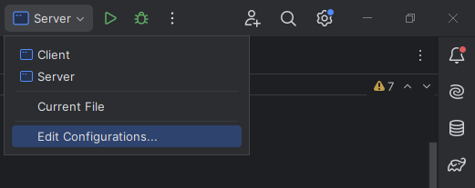
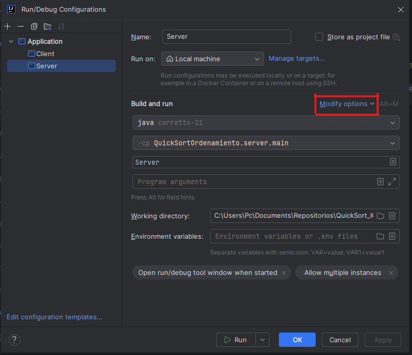

# **[Nota IMPORTANTE](https://github.com/Carlos-SD/QuickSort_ICE/tree/master): El proyecto se encuentra en la rama "master"**

Integrantes:

- Juan Sebastian Caviedez Fernandez A00394958
- Carlos Felipe Sanchez A00404134
- Alejandro Castro A00372470
- Cristian Molina A00404853

## Algoritmo de Ordenamiento QuickSort

> El algoritmo Quicksort es un algoritmo de ordenamiento eficiente y de comparación recursiva. Funciona dividiendo el arreglo en dos subarreglos alrededor de un pivote elegido y luego ordena recursivamente los subarreglos resultantes.

## Instrucciones de Uso

- Paso 1: Para la ejecución de este codigo es mejor utilizar IntelliJ IDEA, Una vez el proyecto se encuentre abierto se necesitará crear varias instancias de la clase "Server" ya que se utilizaran varios servidores para enviarles subarreglos de un arreglo original dado por el cliente para que lo organicen. 

- Paso 2: Para instaciar varias clases, abrimos la clase "Server" y presionamos "Edit Configurations"

- Paso 3: Para este paso presionamos "Modify options"

- Paso 4: Nos aseguramos que este marcada la opción "Allow multiple Instances"

- Paso 5: Ahora podemos correr multiples instancias de la clase "Server". Cuando se ejecute por primera vez el server, debemos tener estos datos en la las siguientes lineas de codigo:

- Para la segunda vez que se ejecute el servidor deben ser los siguiente datos:

- Y por ultimo para la tercera vez los datos deben ser los siguientes:

- Nota: Es muy importante cambiar estos datos exactos a cada uno de los servidores para evitar el siguiente error:

- O este si alguno de los servidores no esta activo (deben ser tres obligatoriamente):

- Paso 6: Por ultimo, una vez ya tenemos los servidores activos, debemos correr el cliente y aparecerá un cuadro de texto como el siguiente:

- Paso 7: Ingresas la cantidad de datos que tendrá el arreglo principal y luego ingresamos los datos del arreglo uno por uno. Luego obtendremos un resultado como el siguiente:

- Finalización